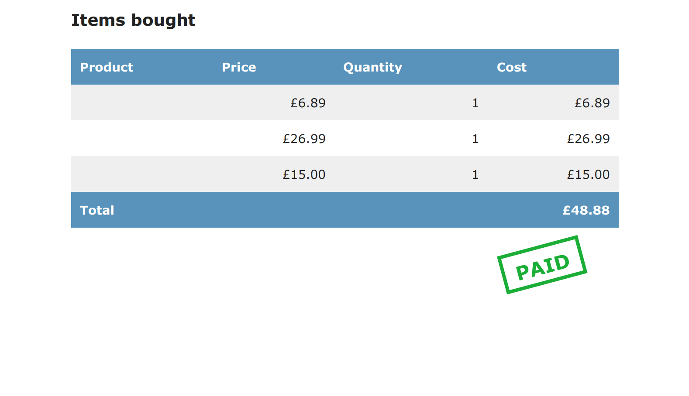

# myshop 🛒

**myshop** is a full-featured Django e-commerce application built to demonstrate
real-world backend development skills, including payments, asynchronous task
processing, internationalisation, and scalable architecture.

This project goes beyond a basic shop to cover production-grade concerns such as
background workers, monitoring, multilingual content, and document generation.

---

## 🚀 Features Overview

- Product catalogue and shopping cart
- Order management and checkout flow
- Stripe payment integration
- Asynchronous background processing with Celery
- PDF invoice generation
- Coupon and discount system
- Product recommendation engine using Redis
- Full internationalisation (i18n) and localisation (l10n)
- Admin customisation and reporting tools

---

## 📸 Screenshots

### Storefront

### Product Detail

### Shopping Cart

### Admin – Orders

### PDF Invoice

## 📌 Tasks Included

### 🛒 Building an Online Shop
- Created a product catalogue with dynamic listings  
- Built a shopping cart using **Django sessions**  
- Implemented custom **template context processors**  
- Managed customer orders and checkout workflows  
- Configured **Celery** with **RabbitMQ** as a message broker  
- Sent asynchronous notifications to customers using Celery  
- Monitored background tasks using **Flower**  

---

### 💳 Managing Payments and Orders
- Integrated the **Stripe** payment gateway  
- Processed credit card payments using Stripe  
- Handled payment notifications (webhooks) and marked orders as paid  
- Exported orders to **CSV** files  
- Created custom views for the Django **administration site**  
- Generated **PDF invoices** dynamically using WeasyPrint  

---

### 📈 Expanding the Shop
- Created a coupon and discount system  
- Applied coupons to the shopping cart and orders  
- Created coupons compatible with **Stripe Checkout**  
- Stored and analysed products frequently bought together  
- Built a **product recommendation engine** using **Redis**  

---

### 🌍 Internationalisation & Localisation
- Prepared the project for **internationalisation (i18n)**  
- Managed translation files  
- Translated Python code and templates  
- Used **Rosetta** to manage translations via the admin interface  
- Translated URL patterns and implemented language prefixes  
- Enabled user-controlled language switching  
- Translated models using **django-parler**  
- Queried translated models using the Django ORM  
- Adapted views to serve translated content  
- Used localised form fields via **django-localflavor**  

---

## 🧰 Tech Stack

### Core
- Python 3
- Django 5.2

### Payments
- Stripe

### Asynchronous Tasks & Monitoring
- Celery
- RabbitMQ
- Flower

### Caching & Recommendations
- Redis

### Internationalisation
- django-parler
- django-rosetta
- django-localflavor

### Documents & Reporting
- WeasyPrint (PDF generation)
- CSV export utilities

---

## 📦 Requirements

All dependencies are listed in `requirements.txt`.

Install with:

## Installation & Setup
 bash
pip install -r requirements.txt

⚙️ Installation & Setup

Clone the repository:

git clone https://github.com/your-username/myshop.git
cd myshop

## Create and activate a virtual environment:

python -m venv env
source env/bin/activate   # Windows: env\Scripts\activate

## Install dependencies:

pip install -r requirements.txt

## Apply migrations:

python manage.py migrate

## Create a superuser:

python manage.py createsuperuser

## Run the development server:

python manage.py runserver

## Access:

Site: http://127.0.0.1:8000/

Admin: http://127.0.0.1:8000/admin/

## 🔧 Background Tasks

Start Celery worker:

celery -A myshop worker -l info

Start Flower monitoring:

celery -A myshop flower

## 🧪 System Checks
python manage.py check

## 📚 Learning & References

This project was built while studying and applying concepts from:

Django 5 By Example
Build powerful and reliable Python web applications from scratch
Fifth Edition — Antonio Mele

The project extends the book’s material with additional experimentation,
customisation, and portfolio-focused improvements.

## 📚 Learning & References

This project was built while studying and applying concepts from:

Django 5 By Example
Build powerful and reliable Python web applications from scratch
Fifth Edition — Antonio Mele

The project extends the book’s material with additional experimentation,
customisation, and portfolio-focused improvements.

## 🛣️ Future Improvements

Add automated test coverage

Deploy to a cloud platform

Improve frontend UX

Add multi-currency support

Extend analytics and reporting

## 📄 License
MIT

This project is for educational and portfolio purposes.